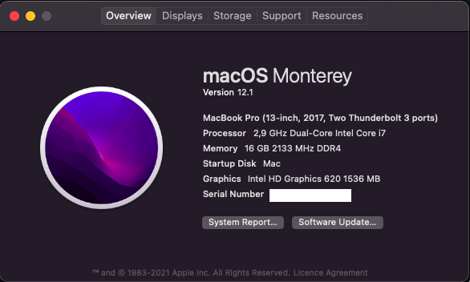
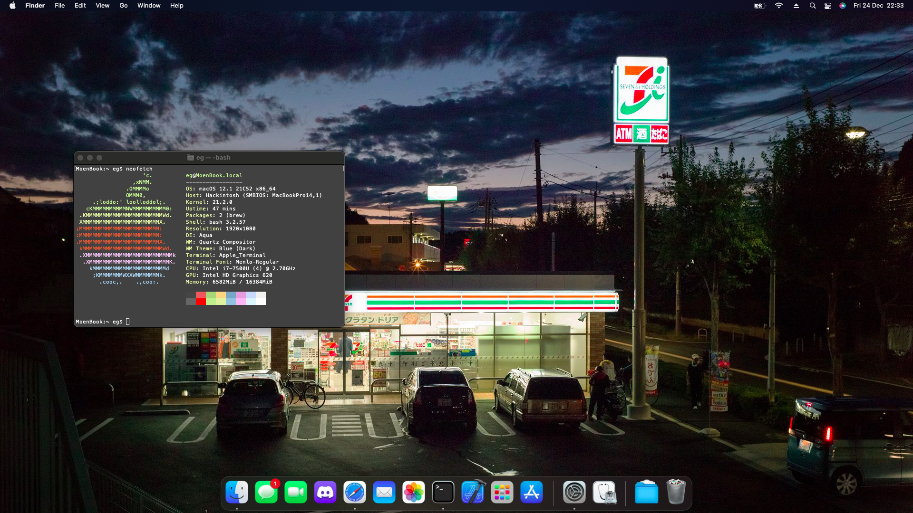

# X270-Monterey-OpenCore
EFI for Monterey OpenCore Hackintosh on the 7th Gen CPU X270

# Introduction
While Monterey is brand spanking new, that also presents problems for those looking to upgrade.
If you're new to hackintosh, prefer stability and/or you're 100% dependent on the touchpad, I would not recommend upgrading but rather staying on something like Big Sur. There are a lot of good repos for this, including [one with a fully functioning touchpad/buttons (my fork)](https://github.com/aerowa/Lenovo-X270-Hackintosh-OpenCore) or [michaeldigiacomi's X270](https://github.com/michaeldigiacomi/Lenovo-X270-Hackintosh-OpenCore)

But honestly, that's probably the biggest downside.

If you're planning to try it, please see the [notes](https://github.com/aerowa/X270-Monterey-OpenCore/blob/main/README.md#notes)

# Tested OS
- [x] macOS Monterey (12.1)

# Hardware
- ThinkPad X270
- i7-7500U
- HD 620 iGPU
- 1TB SSD
- 16GB DDR4 RAM
- Intel AC 8260 (Standard WiFi/BT)
- Standard 1080p IPS screen

# BIOS
- Ver. 
- OpenCore ver. 0.7.6
### Settings
<b>Security</b>
- `Security Chip` **Disabled**
- `Memory Protection -> Execution Prevention` **Enabled**
- `Virtualization -> Intel Virtualization Technology` **Enabled**
- `Virtualization -> Intel VT-d Feature` **Enabled**
- `Anti-Theft -> Computrace -> Current Setting` **Disabled**
- `Secure Boot -> Secure Boot` **Disabled**
- `Intel SGX -> Intel SGX Control` **Disabled**
- `Device Guard` **Disabled**

<b>Startup</b>
- `UEFI/Legacy Boot` **UEFI Only**
- `CSM Support` **No**

# Working
- [x] WiFi (Airportitlwm)
- [x] Bluetooth (see [notes](https://github.com/aerowa/X270-Monterey-OpenCore/blob/main/README.md#notes))
- [X] Ethernet
- [x] AppleID Services (FaceTime, iMessage, App Store)
- [x] Integrated Camera
- [x] HD 620 Graphics
- [x] CPU Power Management
- [x] Battery Management
- [x] Sleep & Resume (Not lid)
- [x] USB Ports
- [x] Audio (+ jack)
- [x] Keyboard (including FN)
- [x] Touchpad - Including gestures, trackpoint & physical buttons ~~(see [notes](https://github.com/aerowa/X270-Monterey-OpenCore/blob/main/README.md#notes))~~
- [x] Shutdown & Restart
- [x] Sleep
- [x] DRM Support (see [notes](https://github.com/aerowa/X270-Monterey-OpenCore/blob/main/README.md#notes))
- [x] FileVault
- [x] Xcode

# Not tested
- HDMI
- SD Reader
- Fingerprint reader
- Sidecar
- AirDrop (Might work if you remove Bluetooth functionality, otherwise incompatible WNIC)
- Dock

# Not working
- ~~Physical Touchpad buttons~~
- Sleep/Wake (lid)
- Apple Watch unlock (WiFi incompatible)

# Future/Todo
- [x] Fix trackpad & physical buttons
- [ ] Improve fan control
- [ ] Tests
- [ ] AirDrop and Sidebar
- [ ] Dock integration
- [ ] Lid sleep
- [ ] Cleanup

# Notes
- This is a WIP directory, it's not pretty
- ~~Touchpad is wonky in Monterey, all gestures work, but they don't work great and might have some small sensitivity issues. This is more so annoying due to the physical buttons not working.~~
- WiFi: is underperforming, this is pretty standard for all Intel WiFi cards using itlwm, solution is unfortunately to step away from Intel card
- WiFi: If you find WiFi to be unstable, replace Airportitlwm with itlwm + HeliPort
- WiFi: The best solution to Apple Watch, AirDrop, etc. issues is simply to replace it with something like BCM94360NG 
- AppleID: To use AppleID services (FaceTime, App store, iMessage etc.) remember to find a new SMBIOS
- DRM: Support on Safari isn't guaranteed, some websites such as Netflix will only accept from other browsers
- Bluetooth injector can result in a slow boot (looks like bootloop - but isn't), disable if not used
- Bluetooth: In the standard setup, Bluetooth injector is disabled due to the above, but will still load some parts ([reason](https://github.com/OpenIntelWireless/IntelBluetoothFirmware/issues/361))
- Batteries: While both batteries "work", as of now it only detects the percentage of the first one, the latter will show 5% until drained and will not trigger automatic sleep.
- A lot of resources are used from [michaeldigiacomi's X270](https://github.com/michaeldigiacomi/Lenovo-X270-Hackintosh-OpenCore) and updated to OpenCore 0.7.6, not everything is perfect even if most of the things work
- Consult with [Lenovo's platform specifications](https://psref.lenovo.com/syspool/Sys/PDF/ThinkPad/ThinkPad_X270/ThinkPad_X270_Spec.PDF) before testing

# Other
- [corpnewt - MountEFI & GenSMBIOS](https://github.com/corpnewt)
- [OpenCore](https://dortania.github.io/OpenCore-Install-Guide/)

# Thank you
- [michaeldigiacomi's X270](https://github.com/michaeldigiacomi/Lenovo-X270-Hackintosh-OpenCore) (Big Sur EFI - i5 series)
- [taida2203's fork](https://github.com/taida2203/Lenovo-X270-Hackintosh-OpenCore) (Big Sur EFI - i7 compatibility)
